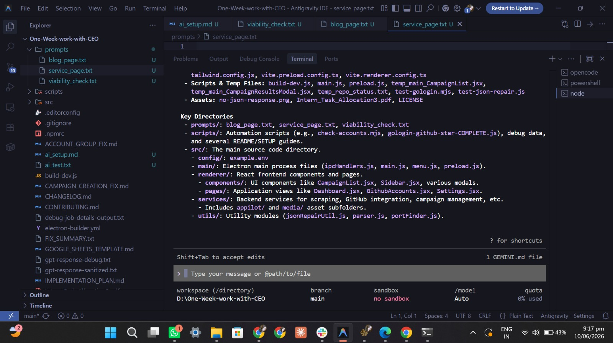

# AI Setup

## Tool selected

**Gemini CLI** is the agentic coding tool used for this project. It is used inside Antigravity IDE with the repository opened as its workspace. Gemini CLI is an equivalent agentic coding tool to OpenCode: it can inspect the codebase, navigate files, make scoped edits, and run terminal commands for validation.

## Project configuration

- **Repository root:** `D:\One-Week-work-with-CEO`
- **Working environment:** Antigravity IDE integrated terminal
- **Agent workspace:** the project root, giving the agent access to the Electron application, Next.js website, scripts, and documentation.

The workflow used for changes is:

1. Ask the agent to inspect the relevant code and dependencies.
2. Review its proposed approach before changing files.
3. Ask for a scoped implementation.
4. Review the resulting code and output.
5. Request corrections or polish where needed.
6. Run the appropriate build or validation command.

## Connected models

- **Primary model:** `gemini-3-flash-preview`
- **Routing/utility model:** `gemini-3.1-flash-lite` (`utility_router`)

## Demonstrated agent capabilities

The agent was run from inside this repository and demonstrated that it can:

- Read and summarize the project structure and source files.
- Navigate Electron, React, Next.js, script, and prompt directories.
- Modify files in the workspace when asked.
- Run terminal tools and report the result of its actions.

## Screenshot: agent running in the project

The screenshot below shows Gemini CLI running in Antigravity IDE with `D:\One-Week-work-with-CEO` open as the workspace. The agent has displayed its project inspection results in the integrated terminal.

## Session evidence

The accompanying session summary is saved as [Ai-SetUp-2.jpeg](./Ai-SetUp-2.jpeg). It records successful tool calls and the connected Gemini models for the session.
